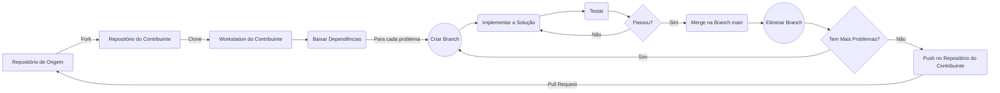

# Pokemon App

O aplicativo (App) usa a API do Pokemon para coletar e apresentar informações sobre cada um deles e foi desenvolvido por [Ruben Manuel](https://www.linkedin.com/in/ruben-manuel-22a412218/) (autor) apenas com o intuíto de colocar na prática os conhecimentos adquiridos no estudo da framework Flutter.

  

## O App na visão do autor

O autor vai explicar o funcionamento do app e a sua utilizade.

  

## Melhorias & Contribuições

O App foi inicialmente publicado pelo autor no Github e no LinkedId para apresentar o seu \[autor] progresso no aprendizado da framework Flutter e tem recebido contribuições de outros entuziastas apaixonados pela framework tal como o [Nelson dos Santos](https://www.linkedin.com/in/nelson-jusserande-lopes-dos-santos/).

Cada contribuição é feita analisando o modus operandi da aplicação no front-end bem como o código-fonte da aplicação e, após a identificação de falhas, bugs ou simplesmente pontos que podem ser melhorados, o contribuinte tem a liberdade de fazer um fork do [repositório](https://github.com/RubenManuel24/Pokemon_app), implementar as alterações necessárias e, em seguida, fazer o pull request no repositório de origem.

O diagrama abaixo ilustra o processo seguido em cada contribuição.

## Lista de Contribuintes

* [Ruben Manuel](https://www.linkedin.com/in/ruben-manuel-22a412218/);
* [Nelson dos Santos](https://www.linkedin.com/in/nelson-jusserande-lopes-dos-santos/).