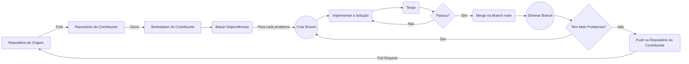

# Pokemon App

O aplicativo (App) usa a API do Pokemon para coletar e apresentar informações sobre cada um deles e foi desenvolvido por [Rubens Manuel](https://www.linkedin.com/in/ruben-manuel-22a412218/) (autor) apenas com o intuíto de colocar na prática os conhecimentos adquiridos no estudo da framework Flutter.

  

## O App na visão do autor

O autor vai explicar o funcionamento do app e a sua utilizade.

  

## Melhorias & Contribuições

O App foi inicialmente publicado pelo autor no Github e no LinkedId para apresentar o seu \[autor] progresso no aprendizado da framework Flutter e tem recebido contribuições de outros entuziastas apaixonados pela framework tal como o [Nelson dos Santos](https://www.linkedin.com/in/nelson-jusserande-lopes-dos-santos/).

Cada contribuição é feita analisando o modus operandi da aplicação no front-end bem como o código-fonte da aplicação e, após a identificação de falhas, bugs ou simplesmente pontos que podem ser melhorados, o contribuinte tem a liberdade de fazer um fork do [repositório](https://github.com/RubenManuel24/Pokemon_app), implementar as alterações necessárias e, em seguida, fazer o pull request no repositório de origem.

O diagrama abaixo ilustra o processo seguido em cada contribuição.

## Contribuições Feitas

### "Ruben Manuel"

Ruben Manuel vai explicar as suas contribuições

  

### "Nelson dos Santos"

#### Contribuição 1: "Faxina" no Código-Fonte

**Problemas**
* _const_ não usado em widgets e construtores imutáveis;
* Ficheiros com pacotes importados mas não usados;
* Uso desnecessário do "!";
* Classe marcada como imutável mas com instancias não _final_
* Presença do comando _print_ no código em produção;
* Importação de pacotes desnecessários (_cupertino.dart_ e _widgets.dart_);
* Posicionamento incorrecto do argumento _child_ em alguns wirgets;
* Uso desnecessário do _router_;
* Ficheiros com pedaços de código desnecessários.
* Falta de informação sobre o projecto no README.md

**Soluções**
* Uso do _const_ em widgets e construtores imutáveis;
* Exclusão dos pacotes não usados;
* Corrigir a lógica que levou ao uso do "!";
* Usar instancias _final_ ou remover o _@immutable_ da classe;
* Apagar todos os comandos _print_;
* Eliminar os pacotes importados mas não necessários;
* Mover o argumento _child_ para o final da lista de argumentos dos widgets;
* Substituir o uso do _router_ pelo _Navigator.push()_;
* Eliminar todos os ficheiros com pedaços de código desnecessários;
* Adição de informações sobre o projecto no README.md